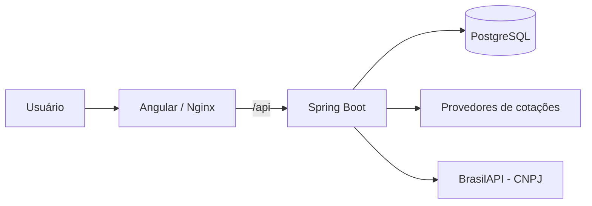

# Fundo Cansil

**Gestão de carteira de investimentos com Angular, Spring Boot e PostgreSQL.**

Aplicação full stack para organizar corretoras, registrar compras e vendas e acompanhar posições, preço médio e cotações. A interface em português reúne a visão consolidada da carteira e o detalhamento por instituição, com acesso autenticado e dados vinculados à conta do usuário.

O sistema registra operações para acompanhamento pessoal; não envia ordens ao mercado.

Repositório: [paulocandiido/Fundo-Cansil](https://github.com/paulocandiido/Fundo-Cansil) · Branch principal: `main`.

## Funcionalidades

- **Autenticação:** cadastro, login com JWT e senhas protegidas com BCrypt.
- **Corretoras:** consulta de CNPJ pela BrasilAPI, cadastro, regularização de vínculos legados e exclusão mediante confirmação.
- **Operações:** registro de compras e vendas com validação de saldo por corretora e horário atribuído pelo servidor.
- **Carteira:** posições consolidadas e por corretora, quantidade, preço médio, custo da posição e filtros de consulta.
- **Avaliação:** atualização manual de cotações, valor atual e lucro ou prejuízo da posição.
- **Históricos:** acompanhamento das operações e das consultas de cotações do usuário.
- **Catálogo:** pesquisa paginada de símbolos pela integração com a brapi.
- **Interface responsiva:** formulários reativos, rotas protegidas e mensagens de carregamento, validação e erro.

## Tecnologias

| Camada | Tecnologias |
| --- | --- |
| Frontend | Angular 22, TypeScript 6, RxJS e CSS |
| Backend | Java 17, Spring Boot 3.5.5, Spring Web e Bean Validation |
| Persistência | Spring Data JPA, Hibernate, PostgreSQL 17 e Liquibase |
| Autenticação | Spring Security, JWT e BCrypt |
| Testes | JUnit 5, Mockito, Spring Boot Test, H2 e Vitest |
| Infraestrutura | Docker Compose, Maven Wrapper e Nginx |
| Integrações | brapi, BrasilAPI e adaptadores para Alpha Vantage e HG Finance |

## Arquitetura

No Docker, o Nginx serve o Angular e encaminha as chamadas `/api` ao backend. O Spring Boot concentra autenticação, regras de negócio e acesso aos dados; o Liquibase aplica as migrações do banco.



A brapi é a fonte de cotações habilitada por padrão. Alpha Vantage e HG Finance possuem adaptadores implementados, mas ficam desativadas na configuração padrão de desenvolvimento e Docker.

## Estrutura do projeto

```text
GestaoAcoes/
├── README.md
├── cansil/                    # Backend e orquestração Docker
│   ├── src/main/java/         # API, segurança, serviços e persistência
│   ├── src/main/resources/    # Configuração e migrações Liquibase
│   ├── src/test/              # Testes unitários e de integração
│   ├── docs/                  # Guias e registros técnicos
│   ├── scripts/               # Ferramentas de apoio
│   ├── .env.example           # Modelo de configuração local
│   ├── compose.yaml
│   ├── Dockerfile
│   └── pom.xml
├── frontend/                  # Aplicação Angular
│   ├── src/app/core/          # Cliente HTTP, sessão, guards e contratos
│   ├── src/app/pages/         # Telas da aplicação
│   ├── src/environments/      # Endereços públicos da API
│   ├── nginx/                 # Servidor estático e proxy da API
│   └── Dockerfile
└── catalogos/                 # Arquivos de referência de ativos
```

Mantenha `cansil` e `frontend` lado a lado: o Compose usa `../frontend` como contexto de compilação da interface.

## Executar com Docker

### Pré-requisitos

- Docker com Compose v2; no Windows, Docker Desktop em execução com contêineres Linux.
- Token da brapi para a integração de cotações.
- Portas `4200`, `8080` e `5433` disponíveis, ou portas alternativas configuradas no `.env`.

Java, Node.js e Maven são usados nas etapas de build das imagens e não precisam estar instalados no host para este modo.

### 1. Configurar o ambiente

Na raiz do projeto, execute no PowerShell:

```powershell
cd cansil
if (-not (Test-Path .env)) { Copy-Item .env.example .env }
```

Edite o `.env` local antes de iniciar:

| Variável | Configuração |
| --- | --- |
| `POSTGRES_DB` | Nome do banco; padrão `cursodb` |
| `POSTGRES_USER` | Usuário do PostgreSQL; padrão `postgres` |
| `POSTGRES_PASSWORD` | Senha privada do banco usado pelo Compose |
| `POSTGRES_VOLUME_NAME` | Nome do volume externo que armazenará os dados |
| `BRAPI_TOKEN` | Token válido do provedor de cotações |
| `JWT_SECRET` | Segredo aleatório de pelo menos 32 bytes |
| `JWT_EXPIRATION_SECONDS` | Validade do token; padrão `3600` segundos |
| `CORS_ALLOWED_ORIGINS` | Origens autorizadas, separadas por vírgula |
| `FRONTEND_PORT` / `APP_PORT` / `POSTGRES_PORT` | Portas do host; padrões `4200` / `8080` / `5433` |

Substitua as credenciais fictícias do exemplo. Mantenha `.env`, tokens e backups fora do versionamento. As chaves dos provedores pertencem somente ao backend.

### 2. Preparar o banco

**Para uma instalação nova, sem dados anteriores**, escolha um nome de volume exclusivo e crie-o:

```powershell
docker volume create fundo-cansil-dados-novo
```

Defina no `.env`:

```dotenv
POSTGRES_VOLUME_NAME=fundo-cansil-dados-novo
```

O volume é externo e precisa existir antes da inicialização. Para um banco já existente, preserve o volume e suas credenciais e siga o [guia Docker](cansil/DOCKER.md). Criar outro volume não recupera dados anteriores.

### 3. Iniciar os serviços

Ainda na pasta `cansil`:

```powershell
docker compose config --quiet
docker compose up -d --build
docker compose ps
```

| Serviço | Acesso padrão |
| --- | --- |
| Aplicação | http://127.0.0.1:4200 |
| API REST | http://127.0.0.1:8080/api |
| PostgreSQL no host | `localhost:5433` |

Abra a aplicação, crie uma conta e faça login. Uma conta nova começa com a carteira vazia. Cadastre uma corretora antes de registrar uma operação.

Para consultar logs ou parar o ambiente preservando os dados:

```powershell
docker compose logs --tail=100 backend
docker compose stop
```

## Desenvolvimento local

### Frontend Angular

Use Node.js 24 compatível com as dependências do projeto e npm. Com o ambiente Docker configurado, execute a partir de `cansil`:

```powershell
docker compose stop frontend
docker compose up -d backend postgres
cd ../frontend
npm.cmd ci
npm.cmd start
```

Acesse http://127.0.0.1:4200. A interface atualiza ao salvar alterações. O endereço da API para esse modo está em `frontend/src/environments/environment.ts`, com padrão `http://localhost:8080`.

### Backend Spring Boot

Use JDK 17 e o Maven Wrapper incluído. Configure as variáveis no ambiente do processo antes de executar, dentro de `cansil`:

```powershell
.\mvnw.cmd spring-boot:run
```

O Spring Boot **não carrega o arquivo `.env` automaticamente**. Para execução local, configure `SPRING_PROFILES_ACTIVE=dev`, `DB_URL`, `DB_USERNAME`, `DB_PASSWORD`, `BRAPI_TOKEN` e `JWT_SECRET`. Se usar o banco Docker com os valores padrão, a URL é `jdbc:postgresql://localhost:5433/cursodb`. Pare o backend Docker antes de usar a mesma porta localmente.

## Testes e build

Execute os comandos nos respectivos diretórios:

| Verificação | Diretório | Comando no PowerShell |
| --- | --- | --- |
| Testes do backend | `cansil` | `.\mvnw.cmd test` |
| Build e verificação do backend | `cansil` | `.\mvnw.cmd verify` |
| Testes do frontend | `frontend` | `npm.cmd test -- --watch=false` |
| Build do frontend | `frontend` | `npm.cmd run build` |
| Build do frontend com proxy Docker | `frontend` | `npm.cmd run build -- --configuration production,docker` |

No Linux/macOS, use `./mvnw` e `npm` nos comandos equivalentes.

A suíte do backend usa o perfil de testes com H2 e migrações Liquibase, com respostas simuladas para serviços externos. Os testes do frontend também simulam HTTP. Essas verificações não exigem tokens reais e não comprovam disponibilidade ou cotas dos provedores em produção.

## API REST

Cadastro e login são públicos. As demais rotas de investimentos exigem `Authorization: Bearer <token>`.

| Método | Endpoint | Descrição |
| --- | --- | --- |
| `POST` | `/api/auth/cadastro` | Criar conta |
| `POST` | `/api/auth/login` | Autenticar e obter JWT |
| `GET` | `/api/usuarios/me` | Consultar usuário autenticado |
| `GET`, `POST` | `/api/corretoras` | Listar e cadastrar corretoras |
| `GET` | `/api/corretoras/cnpj/{cnpj}` | Consultar cadastro pelo CNPJ |
| `DELETE` | `/api/corretoras/{id}` | Excluir corretora e suas transações |
| `GET` | `/api/ativos` | Pesquisar catálogo de ativos |
| `GET`, `POST` | `/api/transacoes` | Listar e registrar operações |
| `GET` | `/api/carteira` | Consultar posições consolidadas |
| `GET` | `/api/carteira/corretoras` | Consultar posições por corretora |
| `GET` | `/api/carteira/avaliacao` | Avaliar posições com cotações |
| `GET` | `/api/cotacoes/{simbolo}` | Consultar cotação de um ativo |
| `GET` | `/api/cotacoes/historico` | Consultar histórico de cotações |

Contratos, exemplos e respostas de erro estão no [guia da API](cansil/FRONTEND.md).

## Regras e limitações

- Compras e vendas exigem valores positivos, com até seis casas decimais. Uma venda precisa respeitar o saldo da corretora selecionada.
- O servidor registra a data e a hora da operação no fuso `America/Sao_Paulo`.
- O custo exibido representa a posição restante. As bases por corretora são gerenciais e podem diferir da visão consolidada; não constituem apuração fiscal.
- O mercado determina a moeda (`BR` → `BRL`; `USA` → `USD`). Não há conversão cambial. A cobertura atual do catálogo é B3; selecionar um mercado não garante que a fonte forneça o ativo ou a moeda solicitada.
- Cotações e novos ativos dependem das permissões, cotas e disponibilidade dos provedores. A atualização é manual e não representa garantia de preço em tempo real.
- Excluir uma corretora remove permanentemente todas as suas compras e vendas. A API não oferece edição ou exclusão individual de operações.
- A sessão do frontend fica em memória: recarregar a página exige novo login. Não há refresh token.
- O Compose fornecido é voltado ao ambiente local. Uma publicação na internet exige configuração de HTTPS, CORS, proteção das rotas legadas e revisão da exposição das portas.

## Documentação

| Documento | Conteúdo |
| --- | --- |
| [Backend](cansil/README.md) | Organização e desenvolvimento da API |
| [Docker](cansil/DOCKER.md) | Serviços, portas, volumes e preservação dos dados |
| [Integração REST](cansil/FRONTEND.md) | Contratos, autenticação e integração com clientes |
| [Regras de investimentos](cansil/INVESTIMENTOS.md) | Domínio, cálculos e integrações externas |
| [Frontend](frontend/INTEGRACAO.md) | Telas, configuração e comportamento da interface |
| [Entrega do backend](cansil/ENTREGA.md) | Empacotamento e alcance das verificações |

## Licença

O projeto ainda não possui um arquivo de licença. As condições de uso e redistribuição precisam ser definidas pelo responsável pelo projeto.
