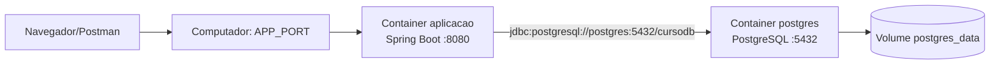

# Java Spring Boot — Aula 12 — Containerização com Docker e Docker Compose

## 12.1 Objetivos da aula

Ao final desta aula o estudante deverá ser capaz de:

- explicar o que são imagem, container, registry, volume, rede e porta;
- diferenciar container de máquina virtual;
- compreender cada instrução do `Dockerfile`;
- construir uma imagem da aplicação Spring Boot;
- executar aplicação e PostgreSQL com Docker Compose;
- entender como os containers se comunicam;
- preservar dados do PostgreSQL em um volume;
- acompanhar logs e diagnosticar problemas;
- explicar como Liquibase participa da inicialização;
- encerrar os containers sem apagar dados acidentalmente.

## 12.2 O problema que será resolvido

Até esta aula, cada estudante precisava preparar manualmente:

- uma versão compatível do Java;
- o PostgreSQL;
- banco e usuário;
- porta disponível;
- variáveis de ambiente;
- comando de inicialização.

Diferenças entre computadores podem produzir a conhecida situação:

> “Na minha máquina funciona.”

Com containers, descrevemos o ambiente de execução em arquivos versionados. A turma passa a utilizar as mesmas imagens base, a mesma versão do PostgreSQL, as mesmas portas internas e o mesmo processo de inicialização.

## 12.3 O que é Docker

Docker é uma plataforma para construir, distribuir e executar aplicações em containers.

Um container é um processo isolado que utiliza recursos do sistema hospedeiro. Ele recebe seu próprio sistema de arquivos, variáveis, rede e visão de processos, mas não precisa carregar um sistema operacional completo para cada aplicação.

### Comparação simplificada

| Máquina virtual | Container |
|---|---|
| Inclui um sistema operacional convidado completo | Compartilha o kernel disponibilizado pelo host Docker |
| Normalmente é maior | Normalmente é menor |
| Pode demorar mais para iniciar | Costuma iniciar rapidamente |
| Isola no nível da máquina virtual | Isola processos, rede e sistema de arquivos |

No Windows e no macOS, o Docker Desktop utiliza internamente uma máquina virtual Linux. Os containers continuam sendo containers Linux executados dentro dessa infraestrutura.

## 12.4 Vocabulário fundamental

### Imagem

Uma imagem é um pacote imutável contendo os arquivos necessários para iniciar um container.

Exemplos utilizados nesta aula:

```text
postgres:17-alpine
maven:3.9.11-eclipse-temurin-17
eclipse-temurin:17-jre-jammy
cansil:local
```

### Container

Um container é uma instância em execução de uma imagem. Uma mesma imagem pode originar vários containers.

Analogia:

```text
Classe Java  → modelo
Objeto       → instância da classe

Imagem       → modelo empacotado
Container    → instância em execução da imagem
```

### Dockerfile

Arquivo de instruções usado para construir uma imagem.

### Registry

Serviço que armazena e distribui imagens. O Docker Hub é um registry. Quando usamos `postgres:17-alpine`, o Docker procura essa imagem no registry configurado.

### Docker Compose

Ferramenta para declarar e executar um conjunto de containers relacionados. Neste projeto o Compose coordena a aplicação e o PostgreSQL.

### Volume

Área persistente administrada pelo Docker. O ciclo de vida do volume é independente do processo do container.

### Rede

Canal de comunicação entre containers. O Compose cria uma rede e registra o nome de cada serviço como hostname.

### Porta

Ponto de comunicação numérico. O mapeamento `8080:8080` possui:

```text
porta do computador : porta dentro do container
```

## 12.5 Arquitetura desta aula



O navegador acessa a porta publicada no computador. A aplicação usa a rede interna para acessar o serviço chamado `postgres`. O PostgreSQL grava seus arquivos no volume.

## 12.6 Pré-requisitos

Instale Docker Desktop no Windows ou macOS. No Linux, instale Docker Engine e o plugin Docker Compose seguindo a documentação oficial da distribuição.

Abra um terminal e execute:

```bash
docker --version
docker compose version
docker info
```

Os dois primeiros comandos verificam os clientes. `docker info` também confirma que o Docker Engine está disponível.

No Docker Desktop, aguarde a indicação de que o mecanismo está em execução antes de continuar.

## 12.7 Arquivos adicionados ao projeto

```text
cansil/
├── .dockerignore
├── .env.example
├── Dockerfile
├── compose.yaml
├── pom.xml
└── src/
```

Cada arquivo possui uma responsabilidade:

| Arquivo | Responsabilidade |
|---|---|
| `Dockerfile` | Construir a imagem da aplicação |
| `compose.yaml` | Executar aplicação e PostgreSQL em conjunto |
| `.dockerignore` | Excluir arquivos do contexto de build |
| `.env` | Fornecer valores locais ao Compose; não é versionado |
| `.env.example` | Documentar as variáveis esperadas |

## 12.8 Criando o `.dockerignore`

Quando executamos `docker build .`, o ponto final representa o contexto de build. O Docker precisa conhecer os arquivos que poderão ser usados por `COPY` e outras instruções.

Não devemos enviar arquivos desnecessários ou segredos para esse contexto. Foi criado o arquivo:

```dockerignore
# Controle de versao e configuracoes das IDEs
.git
.gitignore
.idea
.vscode
*.iml

# Arquivos gerados pelo build e pela aplicacao
target
build
*.class
*.log

# Segredos e configuracoes locais
.env
.env.*

# Arquivos que nao sao necessarios para compilar a aplicacao
docs
README.md
.DS_Store
**/.DS_Store
```

### Explicação

- `.git` não é necessário para compilar a aplicação e pode ser grande;
- `target` contém resultados de builds locais e deve ser recriado dentro da etapa de build;
- `.env` pode conter senha e jamais deve entrar na imagem;
- `.idea` e `.vscode` pertencem às IDEs;
- logs, documentação e arquivos do Finder não participam da compilação.

O `.dockerignore` e o `.gitignore` possuem objetivos diferentes:

```text
.gitignore     → controla o que entra no repositório Git
.dockerignore  → controla o que entra no contexto de construção Docker
```

Um segredo precisa estar protegido nos dois lugares.

## 12.9 Criando o Dockerfile

Conteúdo completo:

```dockerfile
# syntax=docker/dockerfile:1

# Etapa 1: compila o projeto e gera o arquivo JAR.
FROM maven:3.9.11-eclipse-temurin-17 AS build

WORKDIR /workspace

# Copiar o pom antes do codigo permite reutilizar o cache das dependencias.
COPY pom.xml .
RUN mvn -q -DskipTests dependency:go-offline

COPY src ./src
RUN mvn -q -DskipTests package

# Etapa 2: imagem final, contendo somente Java e a aplicacao compilada.
FROM eclipse-temurin:17-jre-jammy AS runtime

WORKDIR /app

# A aplicacao nao precisa executar como o usuario root do container.
RUN groupadd --system spring && useradd --system --gid spring spring

COPY --from=build --chown=spring:spring /workspace/target/*.jar app.jar

USER spring:spring

EXPOSE 8080

ENTRYPOINT ["java", "-jar", "app.jar"]
```

## 12.10 Entendendo o Dockerfile linha a linha

### Diretiva de sintaxe

```dockerfile
# syntax=docker/dockerfile:1
```

Seleciona a sintaxe moderna do Dockerfile usada pelo BuildKit.

### Primeira etapa

```dockerfile
FROM maven:3.9.11-eclipse-temurin-17 AS build
```

- `FROM` define a imagem base;
- a imagem possui Maven e JDK 17 em uma base Linux multiplataforma;
- `AS build` nomeia essa etapa;
- essa imagem serve para compilar, não para executar o resultado final.

O uso de duas etapas é chamado multi-stage build.

### Diretório de trabalho

```dockerfile
WORKDIR /workspace
```

Cria ou seleciona `/workspace` dentro da etapa. As próximas instruções usam esse diretório como referência.

### Cache das dependências

```dockerfile
COPY pom.xml .
RUN mvn -q -DskipTests dependency:go-offline
```

Primeiro copiamos somente o `pom.xml`. Em seguida o Maven baixa as dependências.

As instruções do Docker formam camadas. Quando o `pom.xml` não muda, o Docker pode reutilizar a camada das dependências mesmo que uma classe Java tenha sido modificada. Isso acelera os builds seguintes.

Opções Maven:

- `-q`: reduz a quantidade de mensagens;
- `-DskipTests`: não executa testes nesta etapa;
- `dependency:go-offline`: antecipa o download das dependências.

Os testes devem ser executados antes do build:

```bash
./mvnw test
```

### Compilação

```dockerfile
COPY src ./src
RUN mvn -q -DskipTests package
```

Agora o código-fonte é copiado e o Maven gera o JAR em `/workspace/target`.

### Segunda etapa

```dockerfile
FROM eclipse-temurin:17-jre-jammy AS runtime
```

Uma nova etapa começa. Ela contém o Java necessário para executar a aplicação, mas não inclui Maven, código-fonte ou ferramentas de compilação.

Benefícios:

- imagem final menor;
- menos ferramentas desnecessárias;
- superfície de ataque reduzida;
- separação clara entre construir e executar.

### Usuário da aplicação

```dockerfile
RUN groupadd --system spring && useradd --system --gid spring spring
```

Cria um grupo e um usuário de sistema chamados `spring`. Por padrão, várias imagens executam comandos como `root`. A aplicação web não precisa desses privilégios.

### Cópia entre etapas

```dockerfile
COPY --from=build --chown=spring:spring /workspace/target/*.jar app.jar
```

- `--from=build` busca o arquivo na primeira etapa;
- somente o JAR é levado à imagem final;
- `--chown` define o usuário e grupo proprietários;
- o JAR recebe o nome estável `app.jar`.

### Troca de usuário

```dockerfile
USER spring:spring
```

As próximas instruções e o processo final usam o usuário sem privilégios.

### Porta documentada

```dockerfile
EXPOSE 8080
```

Documenta que a aplicação escuta a porta 8080 dentro do container. `EXPOSE` não publica a porta no computador. A publicação é feita pelo Compose.

### Processo principal

```dockerfile
ENTRYPOINT ["java", "-jar", "app.jar"]
```

Define o processo principal. Enquanto o Java estiver em execução, o container permanece ativo. Quando o processo termina, o container para.

## 12.11 Construindo somente a imagem da aplicação

Na raiz do projeto:

```bash
./mvnw test
docker build -t cansil:local .
```

Explicação do segundo comando:

- `docker build`: inicia a construção;
- `-t cansil:local`: atribui nome e tag;
- `.`: utiliza a pasta atual como contexto.

Liste a imagem:

```bash
docker image ls cansil
```

Uma imagem não é um container em execução. Ela é o resultado que poderá originar containers.

## 12.12 Por que não executar a imagem isoladamente ainda

A aplicação precisa do PostgreSQL. Poderíamos criar rede, volume e dois containers usando vários comandos `docker run`, mas isso espalharia a configuração pelo terminal.

O Compose registra essa topologia em um arquivo versionado.

## 12.13 Preparando as variáveis para o Compose

O `.env.example` recebeu:

```dotenv
# Variaveis utilizadas pelo Docker Compose
POSTGRES_DB=cursodb
POSTGRES_USER=postgres
POSTGRES_PASSWORD=troque-esta-senha
POSTGRES_PORT=5432
APP_PORT=8080
```

Se ainda não existir `.env`, crie-o a partir do exemplo. Se ele já existir por causa da Aula 10, apenas adicione as novas variáveis.

Windows PowerShell:

```powershell
Copy-Item .env.example .env
```

Linux ou macOS:

```bash
cp .env.example .env
```

Troque as duas ocorrências de senha por valores locais. O `.env` não será incluído no Git nem no contexto Docker.

O Docker Compose lê automaticamente um `.env` localizado ao lado do `compose.yaml` para substituir expressões `${NOME}`. Isso é diferente das variáveis que serão entregues ao processo Spring dentro do container.

## 12.14 Criando o `compose.yaml`

Conteúdo completo:

```yaml
name: cansil

services:
  postgres:
    image: postgres:17-alpine
    restart: unless-stopped
    environment:
      POSTGRES_DB: ${POSTGRES_DB:-cursodb}
      POSTGRES_USER: ${POSTGRES_USER:-postgres}
      POSTGRES_PASSWORD: ${POSTGRES_PASSWORD}
    ports:
      - "${POSTGRES_PORT:-5432}:5432"
    volumes:
      - postgres_data:/var/lib/postgresql/data
    healthcheck:
      test: ["CMD-SHELL", "pg_isready -U ${POSTGRES_USER:-postgres} -d ${POSTGRES_DB:-cursodb}"]
      interval: 5s
      timeout: 5s
      retries: 10
      start_period: 10s

  aplicacao:
    build:
      context: .
      dockerfile: Dockerfile
    image: cansil:local
    restart: unless-stopped
    depends_on:
      postgres:
        condition: service_healthy
    environment:
      SPRING_PROFILES_ACTIVE: dev
      DB_URL: jdbc:postgresql://postgres:5432/${POSTGRES_DB:-cursodb}
      DB_USERNAME: ${POSTGRES_USER:-postgres}
      DB_PASSWORD: ${POSTGRES_PASSWORD}
    ports:
      - "${APP_PORT:-8080}:8080"

volumes:
  postgres_data:
```

## 12.15 Entendendo o Compose linha a linha

### Nome do projeto

```yaml
name: cansil
```

Agrupa rede, containers e volumes criados por esta composição.

### Serviços

```yaml
services:
  postgres:
  aplicacao:
```

Um serviço descreve como executar um tipo de container. Temos um serviço para o banco e outro para o Spring Boot.

### Imagem oficial do PostgreSQL

```yaml
image: postgres:17-alpine
```

O banco usa a imagem oficial do PostgreSQL 17 baseada em Alpine Linux.

### Política de reinício

```yaml
restart: unless-stopped
```

O Docker tenta reiniciar o serviço se ele parar inesperadamente, exceto quando o usuário o interrompe explicitamente.

### Inicialização do PostgreSQL

```yaml
environment:
  POSTGRES_DB: ${POSTGRES_DB:-cursodb}
  POSTGRES_USER: ${POSTGRES_USER:-postgres}
  POSTGRES_PASSWORD: ${POSTGRES_PASSWORD}
```

A imagem oficial utiliza essas variáveis na primeira inicialização do diretório de dados.

A sintaxe `${VAR:-padrao}` significa: usar a variável quando definida e não vazia; caso contrário, usar o valor padrão.

Não foi definido padrão para a senha. Se `POSTGRES_PASSWORD` estiver ausente, o PostgreSQL recusa a inicialização.

### Publicação do PostgreSQL

```yaml
ports:
  - "${POSTGRES_PORT:-5432}:5432"
```

A porta interna permanece 5432. `POSTGRES_PORT` controla a porta do computador. Isso permite conectar pelo IntelliJ Database, DBeaver ou `psql`.

Se a porta 5432 já estiver ocupada, use no `.env`:

```dotenv
POSTGRES_PORT=5433
```

Essa mudança afeta somente o acesso pelo computador. A aplicação containerizada continua usando `postgres:5432` na rede interna.

### Volume do banco

```yaml
volumes:
  - postgres_data:/var/lib/postgresql/data
```

O diretório onde PostgreSQL grava os dados é associado ao volume `postgres_data`. Recriar o container não apaga automaticamente o volume.

### Healthcheck

```yaml
healthcheck:
  test: ["CMD-SHELL", "pg_isready -U ${POSTGRES_USER:-postgres} -d ${POSTGRES_DB:-cursodb}"]
  interval: 5s
  timeout: 5s
  retries: 10
  start_period: 10s
```

Iniciar o processo do PostgreSQL não significa que ele já aceita conexões. `pg_isready` testa sua disponibilidade.

- `interval`: intervalo entre verificações;
- `timeout`: tempo máximo de cada tentativa;
- `retries`: quantidade de falhas toleradas;
- `start_period`: período inicial para o banco preparar seus arquivos.

### Build da aplicação

```yaml
build:
  context: .
  dockerfile: Dockerfile
image: cansil:local
```

O Compose constrói a imagem usando o Dockerfile da raiz e atribui o nome `cansil:local`.

### Dependência saudável

```yaml
depends_on:
  postgres:
    condition: service_healthy
```

O container da aplicação é iniciado somente depois que o healthcheck do PostgreSQL informa estado saudável.

Isso organiza a ordem inicial, mas a aplicação ainda deve tratar falhas reais de banco que ocorram depois da inicialização.

### Variáveis entregues ao Spring

```yaml
environment:
  SPRING_PROFILES_ACTIVE: dev
  DB_URL: jdbc:postgresql://postgres:5432/${POSTGRES_DB:-cursodb}
  DB_USERNAME: ${POSTGRES_USER:-postgres}
  DB_PASSWORD: ${POSTGRES_PASSWORD}
```

Essas variáveis existem dentro do container da aplicação e são lidas pelos placeholders do `application-dev.properties`.

O trecho mais importante é:

```text
jdbc:postgresql://postgres:5432/cursodb
```

Dentro do container, `localhost` representa o próprio container da aplicação. O banco está em outro container. Por isso usamos `postgres`, que é o nome DNS fornecido pelo Compose para o serviço do banco.

### Publicação da aplicação

```yaml
ports:
  - "${APP_PORT:-8080}:8080"
```

O Tomcat interno escuta 8080. A variável `APP_PORT` escolhe a porta do computador.

## 12.16 Validando a configuração antes de executar

```bash
docker compose config
```

Esse comando:

- lê `compose.yaml`;
- aplica valores do `.env`;
- normaliza a configuração;
- informa erros de sintaxe ou variáveis ausentes.

Como o resultado pode exibir a senha resolvida, não copie sua saída para fóruns, prints ou commits.

Para listar somente os serviços:

```bash
docker compose config --services
```

Resultado esperado:

```text
postgres
aplicacao
```

## 12.17 Construindo e iniciando todo o ambiente

Execute os testes primeiro:

```bash
./mvnw test
```

Construa as imagens:

```bash
docker compose build
```

Inicie em segundo plano:

```bash
docker compose up -d
```

Também é possível construir e iniciar em um único comando:

```bash
docker compose up -d --build
```

O parâmetro `-d` significa detached: o terminal é liberado enquanto os containers continuam executando.

## 12.18 Observando os containers

```bash
docker compose ps
```

Estados comuns:

| Estado | Significado |
|---|---|
| `running` | Processo principal em execução |
| `healthy` | Healthcheck passou |
| `starting` | Healthcheck ainda está aguardando |
| `exited` | Processo terminou; examine os logs |

Logs de todos os serviços:

```bash
docker compose logs
```

Logs da aplicação em tempo real:

```bash
docker compose logs -f aplicacao
```

Use `Ctrl+C` para parar de acompanhar os logs. Isso não encerra o container quando o Compose está em modo detached.

## 12.19 O que acontece na primeira inicialização

```text
1. Docker cria a rede do projeto.
2. Docker cria o volume postgres_data.
3. PostgreSQL inicializa o banco e o usuário.
4. Healthcheck espera o banco aceitar conexões.
5. A aplicação Spring Boot inicia com o perfil dev.
6. Liquibase cria DATABASECHANGELOG e DATABASECHANGELOGLOCK.
7. Liquibase executa os changeSets pendentes.
8. Hibernate valida o schema.
9. DBService cadastra os dados didáticos se o banco estiver vazio.
10. Tomcat disponibiliza a API na porta 8080 interna.
```

Nas próximas inicializações, o volume mantém os dados e o Liquibase reconhece os changeSets já executados.

## 12.20 Testando a API

Se `APP_PORT=8080`:

```bash
curl http://localhost:8080/api/grupoproduto/all
curl http://localhost:8080/api/produto/all
```

No Postman, mantenha:

```text
BaseUrl = http://localhost:8080
```

Se a porta foi alterada no `.env`, ajuste a URL.

## 12.21 Entrando no PostgreSQL do container

```bash
docker compose exec postgres psql \
  -U postgres \
  -d cursodb
```

Dentro do `psql`:

```sql
\dt

select id, author, filename, dateexecuted
from databasechangelog
order by orderexecuted;

select * from grupoproduto;

\q
```

Se `POSTGRES_USER` ou `POSTGRES_DB` foram alterados no `.env`, utilize os mesmos valores no comando.

Também é possível executar uma consulta diretamente:

```bash
docker compose exec postgres psql \
  -U postgres \
  -d cursodb \
  -c "select count(*) from produto;"
```

## 12.22 Executando apenas o PostgreSQL

Durante o desenvolvimento no IntelliJ, pode ser útil manter somente o banco no Docker e executar o Java pela IDE:

```bash
docker compose up -d postgres
```

Nesse cenário, configure no IntelliJ:

```text
SPRING_PROFILES_ACTIVE=dev
DB_URL=jdbc:postgresql://localhost:5432/cursodb
DB_USERNAME=postgres
DB_PASSWORD=sua-senha-local
```

Se `POSTGRES_PORT=5433`, a URL externa passa a ser:

```text
jdbc:postgresql://localhost:5433/cursodb
```

Resumo:

```text
Java na IDE        → usa localhost e a porta publicada
Java no Compose    → usa postgres e a porta interna 5432
```

## 12.23 Parando sem apagar os dados

```bash
docker compose stop
```

Interrompe os containers, mantendo-os criados.

```bash
docker compose start
```

Inicia novamente os containers existentes.

```bash
docker compose down
```

Remove containers e rede do projeto, mas preserva o volume nomeado. Na próxima execução, os dados retornam.

## 12.24 Apagando também o banco

```bash
docker compose down --volumes
```

ou:

```bash
docker compose down -v
```

Esse comando remove também o volume `postgres_data` e, portanto, apaga o banco desta composição.

> Use `-v` somente quando a intenção for recriar o banco do zero. Faça backup de dados importantes antes.

Depois:

```bash
docker compose up -d --build
```

O Liquibase reconstruirá um banco vazio.

## 12.25 Alterando o código e reconstruindo

O código-fonte não é montado como volume no container. Ele é compilado durante o build da imagem.

Após alterar uma classe:

```bash
./mvnw test
docker compose up -d --build aplicacao
```

O Docker reutiliza as camadas válidas e recompila o necessário.

Para forçar um build sem cache durante um diagnóstico:

```bash
docker compose build --no-cache aplicacao
```

Não use `--no-cache` como rotina, pois ele elimina a vantagem do cache de dependências.

## 12.26 Inspecionando imagens, rede e volume

Imagens:

```bash
docker image ls
```

Containers do projeto:

```bash
docker compose ps
```

Redes:

```bash
docker network ls
```

Volumes:

```bash
docker volume ls
```

Detalhes da imagem da aplicação:

```bash
docker image inspect cansil:local
```

Histórico de camadas:

```bash
docker image history cansil:local
```

Não altere manualmente arquivos internos do container para corrigir a aplicação. A correção deve ser feita no código ou Dockerfile e uma nova imagem deve ser construída.

## 12.27 Segurança aplicada nesta implementação

### A senha não entra na imagem

O `.env` está no `.dockerignore`. A senha é fornecida somente ao criar o container.

### A aplicação não executa como root

O Dockerfile cria o usuário `spring` para a etapa de runtime.

### A imagem final não contém Maven nem código-fonte

O multi-stage build copia apenas o JAR para a etapa final.

### Imagens base são explícitas

As imagens indicam Java 17, Maven 3.9.11 e PostgreSQL 17. Em projetos de produção, também se pode fixar o digest da imagem para garantir conteúdo idêntico.

### Portas publicadas devem ser avaliadas

Publicamos PostgreSQL para fins didáticos e acesso por ferramentas locais. Em produção, o banco normalmente não deve ficar exposto à internet.

### Variáveis não são um cofre de segredos

Variáveis evitam gravar a senha na imagem ou no Git, mas usuários com acesso administrativo ao Docker podem inspecionar a configuração do container. Ambientes de produção devem usar a solução de segredos da infraestrutura.

## 12.28 Solução de problemas

### `docker: command not found`

Instale Docker Desktop ou corrija o PATH. Feche e reabra o terminal depois da instalação.

### Não foi possível conectar ao Docker daemon

Confirme que Docker Desktop está em execução. No Linux, confirme o serviço Docker e as permissões do usuário.

### Porta 5432 já está em uso

No `.env`:

```dotenv
POSTGRES_PORT=5433
```

Depois execute novamente. A comunicação interna entre containers continua em 5432.

### Porta 8080 já está em uso

```dotenv
APP_PORT=8081
```

Acesse `http://localhost:8081`.

### PostgreSQL informa senha incorreta depois de alterar o `.env`

`POSTGRES_PASSWORD` é aplicada quando o volume é inicializado pela primeira vez. Alterar o `.env` não troca automaticamente a senha que já está gravada no banco.

Opções:

1. alterar a senha com SQL e preservar os dados;
2. em ambiente descartável, executar `docker compose down -v` e recriar o volume.

### A aplicação tenta conectar em `localhost`

Dentro do Compose, confirme:

```yaml
DB_URL: jdbc:postgresql://postgres:5432/cursodb
```

`localhost` dentro do container da aplicação não é o container PostgreSQL.

### A aplicação inicia antes do banco

Verifique `docker compose ps` e os logs do serviço `postgres`. O `depends_on` aguarda o healthcheck, mas credenciais inválidas impedem que o banco se torne saudável.

### Erro de Liquibase: tabela já existe

O volume pode ter sido criado antes da introdução do Liquibase. Consulte a Aula 11 para decidir entre recriar o banco didático ou executar um processo de baseline com `changelog-sync`.

### Build não percebeu uma mudança

```bash
docker compose build --no-cache aplicacao
```

Use apenas para diagnóstico e confirme que o arquivo não está indevidamente listado no `.dockerignore`.

## 12.29 Exercícios

### Exercício 1 — Portas externas

Altere `APP_PORT` para 8081 e `POSTGRES_PORT` para 5433. Explique por que nenhuma classe Java precisou ser modificada.

### Exercício 2 — Persistência

1. Cadastre um produto.
2. Execute `docker compose down`.
3. Execute `docker compose up -d`.
4. Confirme que o produto permanece.
5. Explique o papel do volume.

### Exercício 3 — Banco descartável

Em um ambiente sem dados importantes:

1. execute `docker compose down -v`;
2. suba os serviços novamente;
3. observe Liquibase e `DBService` reconstruindo o ambiente.

### Exercício 4 — Cache

1. execute o build duas vezes sem alterar arquivos;
2. altere apenas uma classe Java;
3. execute novamente;
4. identifique quais camadas foram reutilizadas.

### Exercício 5 — Diagnóstico

Altere temporariamente o hostname `postgres` para `localhost` no `compose.yaml`. Observe o erro, explique sua causa e restaure o arquivo.

## 12.30 Checklist da aula

- [ ] Sei diferenciar imagem e container.
- [ ] Sei explicar cada etapa do Dockerfile.
- [ ] Entendo por que o build possui duas etapas.
- [ ] Sei o que o `.dockerignore` protege.
- [ ] Consigo validar o Compose com `docker compose config`.
- [ ] Os serviços `postgres` e `aplicacao` iniciam.
- [ ] O PostgreSQL fica saudável antes da aplicação.
- [ ] A API responde pela porta publicada.
- [ ] Liquibase executa automaticamente.
- [ ] Os dados sobrevivem a `docker compose down`.
- [ ] Entendo que `docker compose down -v` apaga o banco.
- [ ] Sei executar apenas o PostgreSQL para trabalhar pela IDE.

## 12.31 Ponto de versionamento

Antes do commit:

```bash
./mvnw test
docker compose config
docker compose build
git status
```

Versionamento:

```bash
git add .
git commit -m "Aula 12: containeriza aplicacao e PostgreSQL"
git tag -a aula-12-docker -m "Aplicacao containerizada com Docker Compose"
git push origin main --follow-tags
```

Confirme que `.env` não foi incluído no commit.

## 12.32 Referências oficiais

- [Docker — Multi-stage builds](https://docs.docker.com/build/building/multi-stage/)
- [Docker — Boas práticas de build](https://docs.docker.com/build/building/best-practices/)
- [Docker — Referência do Dockerfile](https://docs.docker.com/reference/dockerfile/)
- [Docker Hub — Imagem oficial do PostgreSQL](https://hub.docker.com/_/postgres)
- [Spring Boot — Container Images](https://docs.spring.io/spring-boot/3.5/reference/packaging/container-images/index.html)
